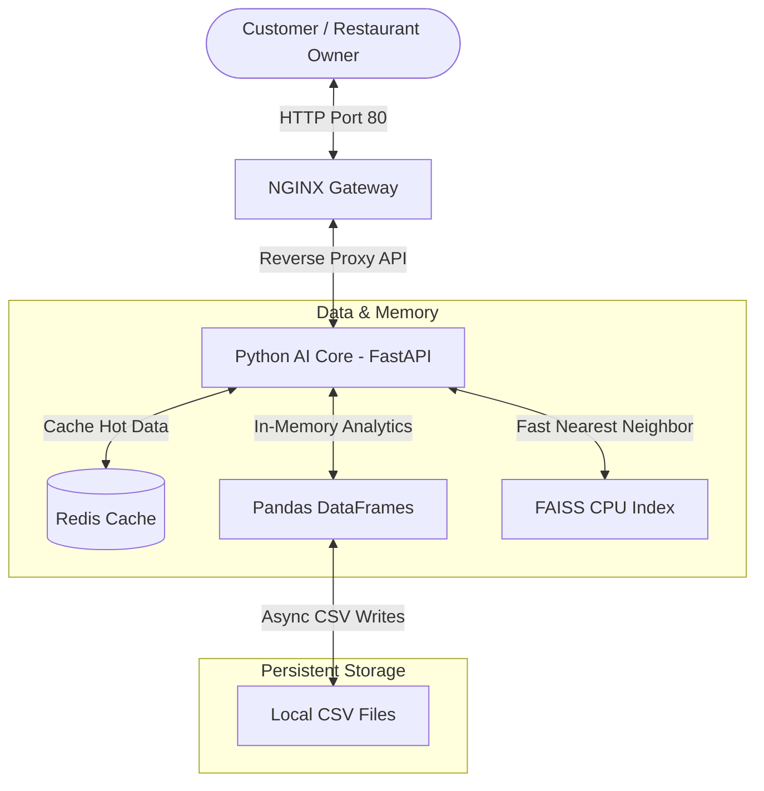
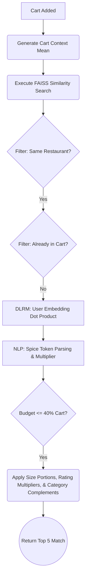
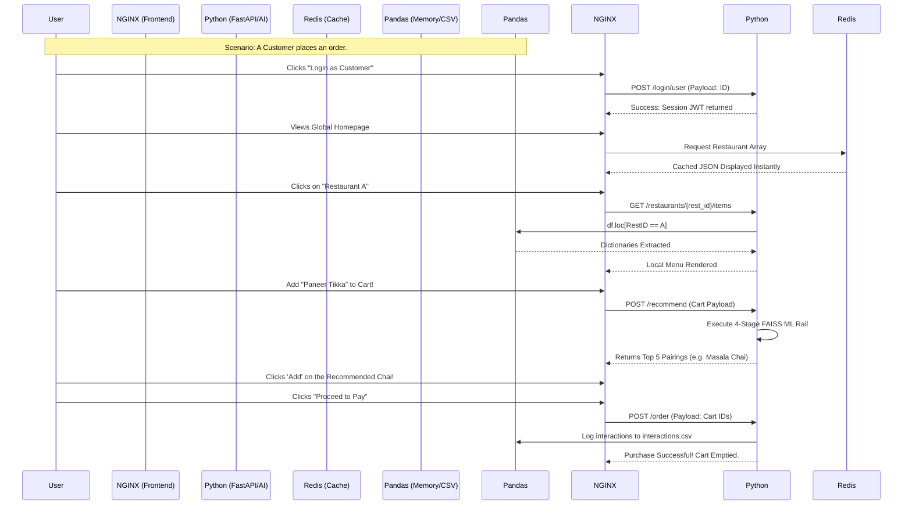

# Zomathon: Multi-Tenant Platform & Intelligent CSAO Rail

Welcome to Zomathon's core engine! 🚀

Zomathon is an ultra-fast, multi-tenant digital food delivery platform equipped with a powerful Cart Super Add-On (CSAO) Recommendation AI. We have completely rebuilt the intelligence layer using lightning-fast mathematical representations powered by **FAISS** and **NumPy**. The result? Intelligent cross-selling pairings delivered under 200 milliseconds without requiring heavy GPUs or PyTorch.

---

## ✨ Key Platform Features

- **Multi-Tenant Authentication**: Distinct login flows and dashboards for Customers and Restaurant Owners.
- **Advanced Search & Filtering**: Debounced global search prioritizing ratings, with Veg/Non-Veg toggles and food category filters.
- **Interactive Recommendation Engine**: AI-powered context-aware cross-selling (CSAO Rail) offering real-time pairings based on cart synergy. Supports user-driven **Recommendation Rejection** for feedback computing loops.
- **Dynamic Owner Dashboard (CRUD)**: Restaurant Owners can natively create, update, and delete menu items directly from the UI. Changes instantly re-index the FAISS ML models and Redis caches.
- **Intelligent Cart Logic**: Budget capping, portion size balancing, hero-rating boosting, and complementary category pairing.
- **Zero-Latency Database Operations**: Eliminates traditional DB locks by loading full catalogs into Pandas Memory and writing asynchronously to persistent CSVs.
- **Order History Tracking**: Fully tracks user clickstreams, cart additions, and final checkouts into memory-based logs dynamically.

---

## 🏗️ 1. Architecture Overview

The system runs entirely via Docker Compose in a robust, multi-container architecture. Below is a macro-level diagram of the overarching architecture and its communication flow:



The application is orchestrated via a pristine 3-tier architecture connected securely via a custom bridge network (`titan-net`):

1. **Frontend Gateway (`nginx:alpine`)**: Runs on port `80`. Serves lightweight frontend HTML, CSS, and JS files natively and acts as a reverse proxy, instantly routing `/api/v1/*` REST requests back to the AI Core.
2. **AI & Logic Core (`python:3.11-slim`)**: Runs on port `8080`. The beating heart of the platform. Built using **FastAPI** and **Uvicorn**, it loads the entire restaurant catalog into **Pandas Dataframes** in RAM for instantaneous CRUD operations, eliminating database latency.
3. **High-Speed Cache (`redis:alpine`)**: Runs natively inside the cluster. Used to instantly return cached Restaurant lists and Search Results to the UI.

---

## 🗂️ 2. File & Folder Structure

The application is separated cleanly by concerns, making the repository easy to grok and deploy.

```text
/Zomathon
│
├── docker-compose.yml       # Orchestrates gateway, redis, and python backend networking and volumes.
├── README.md                # Comprehensive system documentation (You are here).
├── generate_items.py        # Scalable automated script designed to generate realistic item catalogs.
│
├── users.csv                # Persistent Data: Mock Customer base holding user context & spice tolerances.
├── items.csv                # Persistent Data: Active Global Item Catalog (~2000 real-world dishes). Written back during CRUD.
├── restaurants.csv          # Persistent Data: Partner Restaurants with Lat/Lon, Ratings, and Cuisines.
├── interactions.csv         # Persistent Data: Active Order History Tracker. Written back during Checkout.
│
├── gateway/                 # NGINX Frontend Service Directory
│   ├── Dockerfile           # Minimal configuration to host the HTML files on an Nginx alpine image.
│   ├── nginx.conf           # Reverse proxy rules routing `/api/v1/` traffic accurately to `python-ai-core:8080`.
│   └── html/                # Statically served multi-tenant web application.
│       ├── index.html       # Clean HTML Shell handling views for Home, Search, Restaurant Menu, and Owner Dashboard.
│       ├── styles.css       # Custom variables, animations, grid systems, and layouts. No heavy frameworks.
│       └── app.js           # Lightweight Stateful Vanilla JS (ES6) controlling routing, APIs, DOM renders, and local storage.
│
└── python_ai_core/          # Pure Python & AI Service Directory
    ├── Dockerfile           # Container instructions specifically targeting Python 3.11 Slim to run the backend loop.
    ├── requirements.txt     # Python dependencies mapping exactly to what the application needs.
    └── main.py              # The unified script hosting all FastAPI REST Endpoints, Redis Connections, and the 4-Stage CSAO ML Pipeline.
```

---

## 💻 3. Technologies Used

We rely on a hyper-efficient, stripped-down ecosystem mapping strictly to required functional domains.

| Technology | Domain | Description & Use-Case in Zomathon |
| :--- | :--- | :--- |
| **Docker** | DevOps | The primary virtualization technology used to encapsulate the services into isolated, identical, fast-booting containers. Ensures "works on my machine" runs flawlessly anywhere. |
| **Docker Compose** | DevOps | The orchestration mechanism configuring networks, volumes, environment variables, and coordinating the startup sequence between NGINX, Python, and Redis simultaneously. |
| **Vanilla HTML5 & CSS3** | Frontend | Pure, frameworkless UI markup layout guaranteeing zero bundle bloat and sub-second First Contentful Paint. |
| **Vanilla JS (ES6+)** | Frontend | Stateful logic (`app.js`) handling view routing, local storage sessions, modal toggling, Cart management, and debounced API calls for searches. |
| **FontAwesome** | Frontend | Inserted via CDN for lightweight but diverse iconography natively injected across the site's layout. |
| **NGINX** | Network / Proxy | Used as an edge web server inside the `gateway` container. We map `nginx.conf` to statically serve the UI and securely `proxy_pass` to backend Python APIs. |
| **Redis** | In-Memory Cache | Fast caching layer for global home requests and debounced heavy searches (`/search?q=x`). Reduces heavy load on the Pandas runtime via 5-minute cache TTL limits. |
| **FastAPI** | Backend Framework | Chosen for extreme ASGI speed and asynchronous handling of overlapping user API connections. Provides simple REST endpoint configurations. |
| **Uvicorn** | Application Server | The robust ASGI web server implementation driving FastAPI. Boots the application natively at `0.0.0.0:8080` internally. |
| **Pydantic** | Schema Validation | Provides stringent type-checking for incoming REST payload models (e.g., `OrderRequest`, `ItemCreate`, `InferenceRequest`). If users submit bad data, Pydantic throws an immediate 422 Unprocessable Entity error. |
| **Pandas** | DB / Data Layer | The heavy core lifting mechanism! The entire database acts in memory via extremely fast C-implemented DataFrame objects. Performs the heavy filtering operations during ranking and natively pushes data back to the CSV volumes for persistence. |
| **NumPy** | Mathematics | Executes the matrix permutations, sequence averaging (Context Vectors), dot-product calculations (Scores), and randomization heuristics natively acting as our model's tensor engine without PyTorch bloat. |
| **FAISS CPU** | Vector Search | (Facebook AI Similarity Search). Operates our initial Stage 1 Retrieval index by organizing 64-dimensional float arrays of items and generating blistering fast Approximate Nearest Neighbor boundaries. |

---

## 🧠 4. End-to-End ML Recommendation Flow (CSAO Rail)

The "Cart Super Add-On" (CSAO) logic lives inside `main.py` under the `POST /api/v1/recommend` endpoint. It is an industrial recommendation track simplified into 4 blistering-fast native functional stages.



### **Stage 1: Scaled Retrieval (FAISS HNSW + Simulated GraphSAGE)**
When a user adds an item to their cart, we immediately convert their *active cart item identifiers* into an average Context Vector.
1. We query the `faiss.IndexHNSWFlat` using this vector.
2. FAISS performs an Approximate Nearest Neighbor algorithm, returning mathematically similar candidates based on 64-dimensional embeddings (simulating GraphSAGE edge proximities).
3. **Hard Bounds Scope Filtering**: The logic strips away any item that is *already inside the user's cart* or *belongs to a different Restaurant*.

### **Stage 2: Sequence Inference (BERT4Rec Simulation)**
The mathematical context bridge! We simulate Transformer logic dynamically taking the NumPy representations of everything inside the user's cart, and computing a scaled mean `context_vector`. This forces the FAISS search space toward items that *bridge the gap* organically.

### **Stage 3: Fine Ranking (Simulated DLRM + NLP Embeddings)**
The remaining items run through a mathematically simulated Deep Learning Recommendation Model (DLRM).
1. We compute a focal dot product between a randomized `user_emb` (User Embedding based on ID trait seed) and candidate embeddings.
2. **NLP Text Parsing**: The backend natively maps words inside the item's `Name` (e.g., "Spicy", "Chilly", "Masala") against the `user_spice_tolerance` factor.
3. If the user profile favors heat and NLP detects "Spicy", the item receives a linear weight boost along with an injection of a custom sentiment string indicating the reason.

### **Stage 4: Core Business Engine & Filters**
Finally, Top items are slammed against hardcoded runtime business rules generated purely inside Pandas DataFrames:
1. **4.1 Budget Restriction**: Recommends are capped to **40% of the active Cart's Total Value**.
2. **4.2 Category Complementarity (Realism Logic)**: To prevent absurd cart combinations, the logic matrix parses the current `Cart_State`.
    * It mathematically *penalizes* candidates of the exact same category (e.g. doesn't suggest a 3rd Main Course if the user bought 2).
    * It massively *boosts* items from complementary categories. If a user adds a Starter, the Top 5 logic immediately prioritizes candidates in the Breads, Sides, and Beverage subsets.
3. **4.3 Package Rule Up-Sells**: If the cart is huge (> ₹600), the system actively boosts items marked `Size: Low` to balance meal portions.
4. **4.4 Hero Rating Multiplier**: Items with `RestRating >= 4.8` are flagged as a "Hero" item, and their rank score surges.

---

## 🏃 5. Software Engineering (SDE) Flow & User Journey

Here is the map detailing how the data navigates the platform depending on which user archetype is actively clicking natively in the Single Page Application UI.



The system beautifully supports CRUD Operations for **Restaurant Owners**:
1. An Owner authenticates via `/login/restaurant` natively through the UI.
2. The UI detects an Owner payload and loads the **Owner Dashboard** view dynamically, revealing a table of their active dish matrix via Pandas extraction.
3. If they hit the "Edit" modal and tweak a price, the system sends an asynchronous `PUT /api/v1/items/{item_id}` payload.
4. The Pandas DataFrame alters memory on the spot, saves asynchronously to the `items.csv`, recalculates completely new mathematical 64-dimensional bounds for the vector catalog, updates the active FAISS engine, and dumps the Redis cache to reflect real-time accuracy.

---

## 💾 6. Data Dictionaries (CSVs)

Since heavy databases were ousted for execution speeds, flat CSV architecture ensures physical persistence upon container reboots.

### `items.csv` (Size: ~300 rows)
Over 2000 dynamically populated permutations of dishes spanning multiple categories globally linked to mock locations.
| Column | Type | Example | Description |
| :--- | :--- | :--- | :--- |
| `ItemID` | STR | `I0201` | Unique string identifying the product. |
| `RestID` | STR | `R015` | The Foreign Key matching the restaurant it belongs to. |
| `Name` | STR | `Spicy Classic Kadai Paneer` | Highly dense string utilized for rendering and NLP token cross-referencing. |
| `Price_INR` | INT | `350` | The integer value used maliciously during Stage 4 Business Math bounding logic. |
| `Is_Veg` | BOOL | `1` / `0` | Hard metric mapped for Global Tag switches in Search algorithms. |
| `Category` | STR | `Main Course` | Dictates proximity logic during context averaging embeddings. |
| `Image_URL` | STR | `/img/item.jpg` | Native static image locations. |
| `Meal_Time` | STR | `Lunch` | Optional heuristical boundary metric. |
| `Size` | STR | `High` | Size token utilized inside Stage 4 Balancing Logics. |

### `restaurants.csv` (Size: 50 rows)
| Column | Type | Example | Description |
| :--- | :--- | :--- | :--- |
| `RestID` | STR | `R045` | Unique restaurant identifier binding the system. |
| `Cuisine` | STR | `Italian` | The parent category for UI labeling. |
| `GPS_Lat` | FLOAT | `28.6194` | Base logic coordinates mappings. |
| `GPS_Long` | FLOAT | `77.2681` | Base logic coordinates mappings. |
| `Rating` | FLOAT | `4.8` | The critical boundary utilized via multipliers during Stage 4 Hero Logic. |
| `Avg_Prep_Time_mins` | INT | `35` | Used optionally for delivery distance & time ranking heuristics. |

### `users.csv` (Size: 200 rows)
| Column | Type | Example | Description |
| :--- | :--- | :--- | :--- |
| `UserID` | STR | `U0001` | Core authentication token utilized across the UI payload tracking events. |
| `Age` | INT | `26` | Deep learning profile feature mapped to generic age demographics. |
| `Gender` | STR | `M` | Demographic tag used strictly for macro-averaging logic permutations. |
| `Veg_Score` | FLOAT | `0.9` | Ratio scale indicating strictly Veg vs Non-Veg behavioral habits. |
| `City_Tier` | INT | `1` | Heuristic marker utilized for baseline geo-distance threshold gating. |
| `Price_Sensitivity` | FLOAT | `0.4` | Determines how tightly the Recommendation Engine clamps Top-Price suggestions. |

### `interactions.csv` (Size: ~900 rows)
*(Automatically generated tracking log mapping user clickstream sequences)*
| Column | Type | Example | Description |
| :--- | :--- | :--- | :--- |
| `SessionID` | STR | `S001` | The clustered parent session identifier binding multiple cart clicks. |
| `UserID` | STR | `U0023` | The customer generating the event matrix mathematically. |
| `Timestamp` | INT | `1703010323` | Unix epoch logging transaction time. |
| `Event` | STR | `click` | The specific engagement action occurring in the funnel. |
| `ItemID` | STR | `I0055` | The target item they checked out or reviewed. |
| `Cart_State` | STR | `['I0001']` | The stringified array snapshot of the user's cart exactly at the moment of interaction. |

---

## 🔥 7. How to Deploy Locally

### Stand Up the Application 
1. Prune dangling resources from cache (optional but recommended):
```bash
docker system prune -f 
docker volume prune -f
```
2. In the `C:\Zomathon\Zomathon` directory, forcefully spawn the composition via detached background compilation:
```bash
docker-compose up -d --build
```

### Accessing the Interface
Wait ~5 seconds for the FAISS logic container to fully boot Pandas into memory and then open your browser at **[http://localhost](http://localhost)** to engage with the completed intelligence layer!