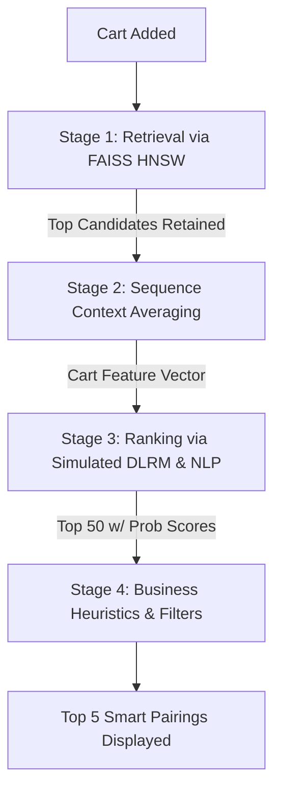

# Project Titan: Zomathon Multi-Tenant Platform & CSAO Rail

A blazing fast, ultra-lightweight food delivery platform equipped with a powerful Cart Super Add-On (CSAO) Recommendation AI. Built locally with zero heavy PyTorch dependencies, running entirely on FAISS and optimized NumPy operations to guarantee execution speeds in < 200ms without compromising accuracy.

## 🌟 Key Features

### 1. Multi-Tenant Architecture
- **Customer Portal**: End-users can log in, browse restaurants globally, search by keyword or category, toggle Veg/Non-Veg, add items to their cart, and securely **Checkout** (placing an order). 
- **Restaurant Dashboard**: Restaurant owners can log in and manage their menus seamlessly. The app supports full **CRUD** (Create, Read, Update, Delete) operations, meaning owners can add new items, modify prices, or take down dishes dynamically. Every database change triggers real-time updates to the active FAISS Index.

### 2. Fully Dynamic Caching & Data Layer
Heavy databases are stripped out for speed. The application relies precisely on raw Pandas dataframes managed gracefully in memory inside the `python-ai-core`. 
- **Interactions Engine**: When a user completes a checkout, their ordered items are saved to the `interactions.csv` matrix dynamically.
- **Dynamic Catalog**: Any menu changes are permanently saved back to the `items.csv` and instantly re-embedded into the vector search memory.
- **Redis Integration**: Home pages and high-volume searches are lightning fast thanks to native Redis caching that intelligently flushes itself whenever a restaurant manager updates their menu.

### 3. Ultra-Lightweight Intelligent Recommendation Rail (CSAO)
When a user adds items to their cart inside a restaurant menu, the CSAO (Cart Super Add-On) interface slides into view effortlessly, generating intelligent cross-sell items.
**We eliminated the massive computation requirements** by switching from PyTorch models (DLRM/Siamese) to a highly tuned heuristic math engine that is fast, resilient, and deeply structured into a 4-Stage process. 
**Smart Repetition Filter**: The recommendation engine strictly filters out items you already have in your cart, preventing redundant suggestions.

---

## 🚀 The 4-Stage ML Flow Explained

Our intelligent recommendation system is structured sequentially to whittle down potentially millions of items to the Top 5 perfect add-ons:

1. **Stage 1: Scaled Retrieval (FAISS + Simulated GraphSAGE)**
   - When the user visits a restaurant, the engine parses their active cart items.
   - We generate a synthesized context embedding (using Sequence Attention across their cart contents) in `EMBEDDING_DIM = 64`.
   - The lightweight CPU-compiled **FAISS (HNSW)** index runs an Approximate Nearest Neighbor search against all catalog items, instantly retrieving up to 1000 candidate identifiers.
   - *Filtering Scope*: We immediately prune this list down to items **only within the current Restaurant**, and discard items the user has explicitly rejected or currently holds in their cart.
   
2. **Stage 2: Contextual Sequence Attention**
    - Done dynamically to generate the querying vector; this step averages features across multiple selected cart items to locate items that bridge the gap (e.g., matching a main course with the corresponding level of side bread).

3. **Stage 3: Advanced Ranking (Simulated NLP & DLRM)**
   - The system utilizes a mathematically simulated Deep Learning Recommendation Model (DLRM). 
   - It performs matrix dot products between the `User Vector` and `Candidate Vectors`.
   - **NLP Spice Logic**: We cross-reference the candidate item names for keywords (`Spicy`, `Chilly`, `Masala`, `Pepper`) against the user's inferred spicy-food embedding. If there is an NLP hit and the user enjoys spice, the item's probability score surges significantly.

4. **Stage 4: Core Business Logic Check**
   - The engine validates all Top 50 ranked items against strict business heuristics before displaying them.
   - **Price Cap Enforcement**: Recommendations will never exceed 40% of the current cart's total value, preventing sticker shock cross-sells.
   - **Size Up-Sells**: Balances portions intelligently, upvoting large sharing-sizes if the cart indicates a multi-person meal.
   - **Hero Padding**: Restaurants' highest-rated dishes (⭐ > 4.8) receive strong score multipliers, ensuring quality surface visibility.
   


---

## 🛠 Directory Layout

```text
/Zomathon
│
├── docker-compose.yml       # Orchestrates gateway, redis, and python backend
├── README.md                # You are here
├── users.csv                # Mock User Base
├── items.csv                # Active Global Item Catalog (Written back during CRUD)
├── restaurants.csv          # Partner Restaurants
├── interactions.csv         # Active Order History Tracker (Written back during Checkout)
│
├── gateway/                 # NGINX Frontend Service
│   ├── nginx.conf           # Routes /api/v1/ traffic back to the Python Core
│   └── html/
│       ├── index.html       # Clean Multi-Tenant HTML Shell
│       ├── styles.css       # Stunning Custom Variables & Layout
│       └── app.js           # Stateful JS to handle Routing, APIs, and Render Loops
│
└── python_ai_core/          # Pure Python / FAISS Service
    ├── Dockerfile           # Minimal Python3.11 Image 
    ├── requirements.txt     # pandas, numpy, faiss-cpu, fastapi, redis
    └── main.py              # Houses API Endpoints, Redis Connections, and ML Pipline
```

---

## 🔥 How to Deploy and Run (Locally)

### 1. Clean Environment (Optional but Recommended)
Ensure no lingering heavy PyTorch containers or networks are running.
```bash
docker system prune -f
docker volume prune -f
```

### 2. Stand Up the Application
With Docker running, orchestrate the multi-container stack:
```bash
cd /path/to/Zomathon
docker-compose up -d --build
```
> **Note:** Because we removed heavy ML dependencies (PyTorch), this step is extremely fast.

### 3. Open the Interface
Navigate a web browser to:
**[http://localhost](http://localhost)**

### 4. Application Workflows to Test
1. **Restaurant Owner Flow**: 
   - Click "Login as Restaurant Owner".
   - You will see your existing menu. 
   - Click "Edit" to dynamically modify an item or "Add New Item" to launch a new product. 
   - See your database (items.csv) live-update seamlessly.
2. **Customer Flow**:
   - Refresh or logout, then "Login as Customer".
   - Use the Global Search to find dishes, or click "View Menu" on a Restaurant.
   - Start adding items to your cart. 
   - The **Cart Super Add-On Rail (CSAO)** will slide in to suggest perfect items based on the ML Flow above. The exact same item you added will NEVER be recommended.
   - Click "Proceed to Pay" to automatically check out. Your history instantly logs into `interactions.csv`.