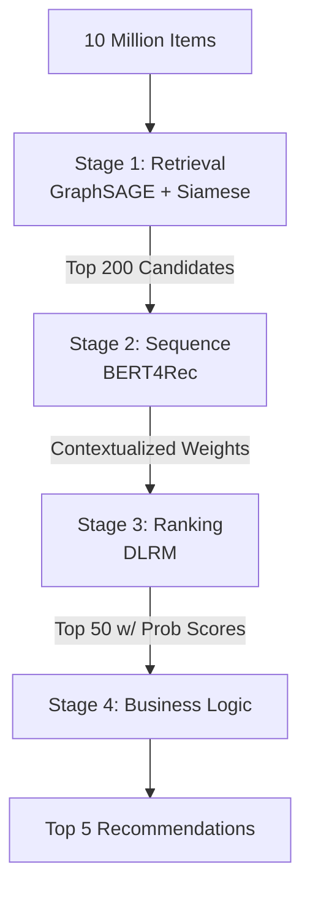

# Project Titan: Cart Super Add-On (CSAO) Rail

## E2E Intelligent Recommendation System Architecture (Ultra-Lightweight Mode)

### ⚡ Platform Multi-Tenant Architecture
- **In-Memory Core + Redis Caching**: Heavy databases are removed. CSV Data is evaluated natively through Pandas inside the `python-ai-core`. **Redis** is natively attached to the container network to instantly cache `Search Results` and `User Sessions` for rapid retrieval.
- **Unified 4-Stage Scoped Logic Container**: Uses FAISS CPU and Numpy mathematics to process logic in <200ms:
  - **Stage 1 (Retrieval)**: Simulated GraphSAGE and Siamese embeddings via FAISS (HNSW) indexing. Filtered securely by active **Restaurant Scope**.
  - **Stage 2 (Sequence)**: Simulated BERT4Rec scaled dot-product attention to predict context gaps based strictly on a user's active sub-cart.
  - **Stage 3 (Ranking - DLRM & NLP)**: Simulated DLRM focal loss predictions calculating user-feature dot product intersections. Integrates **NLP Text Embeddings** parsing keywords like "Spicy", cross-referencing them against a simulated User Spice Tolerance hash.
  - **Stage 4 (Business Logic)**: Limits price (`<= 40% Cart Value`), respects `Package Size`, respects strict `Restaurant Boundaries`, and promotes "Hero" ratings.
- **Premium Multi-View Frontend**: NGINX serves a beautiful, pristine full-stack application supporting stateful Javascript.
  - **Authentication**: Supports Customer login and Restaurant Owner login.
  - **Owner Dashboard (CRUD)**: Restaurants can natively Create, Delete, and Update their menus via API endpoints syncing back to the Pandas backbone.
  - **Global User Matrix**: Customers can globally search, filter by Veg/Non-Veg, dive into specific Restaurant Menus, and receive purely bounded AI cart recommendations.

## 3.1 System Overview
A 4-stage funnel to filter 10M items to Top 5 in < 200ms:


## Directory Map
- `gateway/`: Contains `nginx.conf` and the `html/` folder which holds `index.html`, `styles.css`, and `app.js`.
- `python_ai_core/`: Contains `main.py` and `requirements.txt`. Reads CSVs directly from the root mounted volume (`/app/data`).

---

## 🔥 How to Start and Test the Application

### 1. Wipe Old Corrupted Volumes
If you previously attempted to run the heavy multi-cluster setup, please prune Docker to remove dangling cache:
```powershell
docker system prune -a --volumes -f
```

### 2. Start the Lightweight Stack
Build the lightweight NGINX and Python services natively. This will be an incredibly fast build.
```powershell
cd c:\Zomathon\Zomathon
docker-compose up -d --build
```

### 3. Experience the Live Interface
Wait 5 seconds for the Python backend to ingest the CSV files into memory. 
Open your web browser and navigate to:
**[http://localhost](http://localhost)**

- **Select a User Profile** via the dropdown at the top to simulate different demographics.
- **Add Items** from the "Popular Items" menu.
- Open your **Cart Sidebar** on the right.
- Watch as the **CSAO Rail** instantly and beautifully slides into view, presenting smart pairings based on heuristics that obey price limits (<= 40% Cart Value) and complementary food categories to finish the meal!

### API Diagnostics (Optional)
If you wish to test the backend API alone:
```powershell
curl -X POST http://localhost:80/api/v1/recommend `
     -H "Content-Type: application/json" `
     -d "{
           \"user_id\": \"U0001\",
           \"session_id\": \"S12345\",
           \"cart_items\": [\"I0002\", \"I0023\"],
           \"lat\": 28.5,
           \"lon\": 77.2
         }"
```